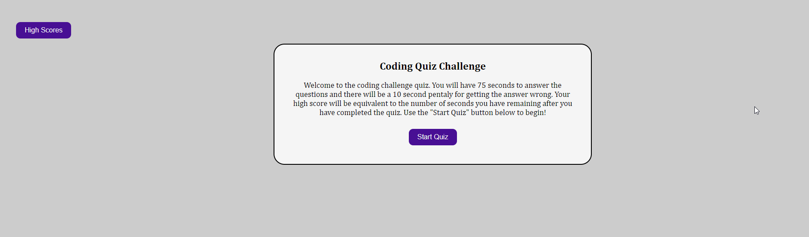
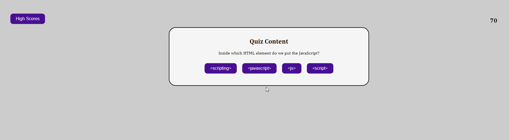
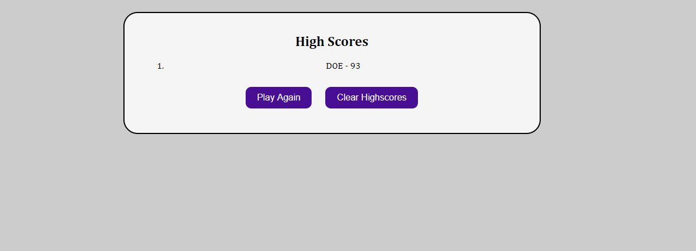

# Code Quiz (JavaScript)

This application will present the user with a timed quiz. This quiz is built on HTML, CSS and JavaScript. The user have 75 seconds to answer the questions and there will be a 10 second pentaly for getting the answer wrong. The high score will be equivalent to the number of seconds you have remaining after you have completed the quiz which includes bonus time for correct responses. The user will use the "Start Quiz" button to begin!

## Acceptance Criteria

```
* Use of a start button
* A time that starts when a question is presented
* Questions rotate one after another once a response is validated
* Incorrect responses will be penalized
* The game ends when ALL questions are answered or the clock reaches 0
* The user can save their score
```

### Deployed URL

https://minnesotanyst.github.io/code-quiz/

### Preview

#### Code Quiz Landing



#### Code Quiz Start



#### Code Quiz High Scores


